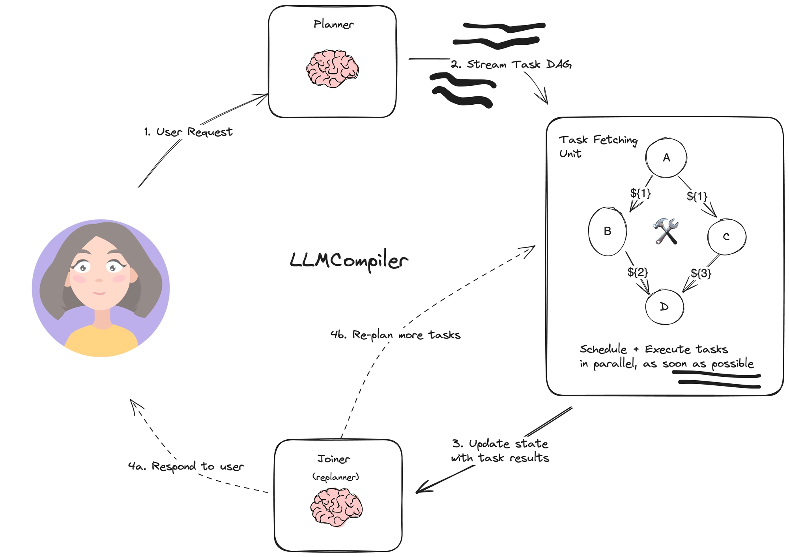
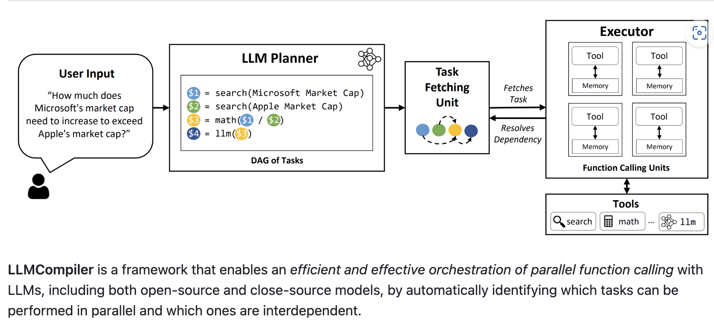

# LLMCompiler

[](README.md)
[](README-zh.md)

&emsp;LLMCompiler is an Agent Architecture designed to speed up the execution of agent tasks by executing them quickly
in the DAG. It also saves the cost of redundant token use by reducing the number of calls to the LLM. The realization
inspiration comes from An LLM Compiler for Parallel Function Calling.

&emsp;Here is an example of using SQL to query data to illustrate the core role of the framework. The core process of generating an execution plan for SQL includes syntax parsing, semantic analysis, optimizer intervention, and generation of an execution plan. When LLMCompiler executes tool calls based on user instructions, it can actually be understood that LLM helps users do a process similar to SQL to generate execution plans, but the generated plan here is a DAG, and the DAG describes the call relationship between tools and the parameter dependency passing logic.

&emsp;This implementation is useful when the agent needs to call a large number of tools. If the tool you need exceeds
the context limit of the LLM, you can extend the agent node based on this tool.Divide the tool into different
agent and assemble them to create a more powerful LLMCompiler. Another case has been
proven in a production-level application, when about 60 Tools were configured, and the accuracy rate was more than 90%
when paired with few-shot.

## LLMCompiler Frame Diagram



&emsp;This image illustrates the system architecture of the LLMCompiler, detailing the entire process of how a user request is
handled, planned, executed, and fed back within the system. Below is a detailed description of each part of the diagram:

1. User Request:

&emsp;On the left, a user avatar represents the system's end-user. The user initiates a request to the system
through an interface or other input methods, marking the start of the entire process.

2. Planner:

&emsp;The user request first enters the "Planner" module, symbolized by a brain icon, representing intelligence and
decision-making capability (LLM). The planner's main responsibility is to parse the user request, understand its intent,
and generate a series of executable task plans based on this understanding. This plan is organized into a Directed
Acyclic Graph (DAG), representing the sequence and dependencies of the tasks.

3. Stream Task DAG:

&emsp;The task DAG stream generated by the planner is passed to the "Task Fetching Unit." The task DAG stream
is a structure that represents the relationships between tasks, ensuring that tasks are executed correctly according to
their dependencies. Each node in the DAG stream represents a specific task, and the edges indicate the dependencies
between tasks.

4. Task Fetching Unit:

&emsp;The Task Fetching Unit is the core execution module of the system. It is responsible for extracting
tasks from the DAG and scheduling them according to their dependencies. Tasks are executed in parallel as much as
possible to improve efficiency. In the diagram, tasks are represented by the letters A, B, C, and D, with arrows
indicating the dependencies and execution order. The tool icons (such as a hammer) signify that this module not only
schedules tasks but also executes them.

5. Update State with Task Results:

&emsp;After task execution is complete, the results are used to update the system's internal
state. State updates are a crucial step in ensuring that all tasks are correctly executed and progress is recorded.

6. Joiner (Replanner):

&emsp;The updated state is passed to the "Joiner" module, which is also represented by a brain icon,
indicating its complex decision-making capabilities. The Joiner's role is to evaluate the updated state, and if the task
results are insufficient to satisfy the user request, it will replan additional tasks and resubmit them to the Task
Fetching Unit for execution. If the task results are sufficient to fulfill the user request, the Joiner will prepare the
final results to be fed back to the user.

7. Respond to User:

&emsp;The final task results are generated by the Joiner and fed back to the user. This closes the loop, with
the user receiving the requested results or information through the system.

&emsp;Overall, this diagram presents a complex task scheduling and execution system, emphasizing the entire process from user
request to task planning, parallel execution, state updating, and feedback. The brain icon symbolizes the intelligent
decision-making modules (LLM) within the system, while the arrows and task nodes demonstrate the professional handling
of task flows and dependencies.

## Task Fetching Unit



&emsp;This image depicts the workflow diagram of the LLMCompiler framework, which is designed to efficiently execute tasks by
parallelly invoking LLMs (Large Language Models). The image is divided into several key sections, described as follows:

1. User Input:

&emsp;On the left side, the user inputs a question in natural language, such as "How much does Microsoft's market cap need to
increase to surpass Apple's market cap?"

2. LLM Planner:

&emsp;The user's input is passed to the LLM Planner, which parses the user's request into a series of tasks (DAG of Tasks).
For example:

- $1 = search(Microsoft Market Cap): Find Microsoft's market cap.
- $2 = search(Apple Market Cap): Find Apple's market cap.
- $3 = math($1 / $2): Perform a calculation to compare the two market caps.
- $4 = llm($3): Pass the result to the large language model for further processing.

3. Task Fetching Unit:

&emsp;The Task Fetching Unit is responsible for retrieving tasks from the LLM Planner and parsing the dependencies between the
tasks. This unit is represented by a diagram (circles and arrows) that shows how tasks are executed sequentially or in
parallel.

4. Executor:

&emsp;The Executor contains multiple "Function Calling Units," each equipped with a tool (Tool) and memory (Memory). All tool
calls are temporarily stored in memory for later use by the parser.
Each unit within the Executor is responsible for executing specific tasks, such as invoking a search engine, performing
mathematical calculations, or calling the LLM.

5. Toolbar:

&emsp;The bottom section displays icons of several tools, including search tools, mathematical tools, and large language
models (LLMs), among others. These tools are used to execute different parts of the user's request.

&emsp;The main functionality of the LLMCompiler framework is to achieve efficient and effective parallel function calls by
automatically identifying which tasks can be executed in parallel and which are interdependent.

&emsp;Overall, the image illustrates how the LLMCompiler framework begins with user input, plans tasks, parses task
dependencies, and finally invokes various tools to complete the tasks.

## How To Use

```shell
pip install llmcompiler
```

```py
from llmcompiler.result.chat import ChatRequest
from llmcompiler.tools.basic import Tools
from langchain_openai.chat_models.base import ChatOpenAI
from llmcompiler.chat.run import RunLLMCompiler

chat = ChatRequest(message="<YOUR_MESSAGE>")

# `tools` is a list based on Langchain BaseTool, `Tools.load_tools` can automatically load Tools from specified directories or `.py` files.
# The default configuration is only for demonstration purposes, it is recommended to inherit `BaseTool` or `CompilerBaseTool` to implement Tool, which can better control some details.
# No parameter dependencies are required, you can inherit `BaseTool` to implement Tool, with the implementation reference being `llmcompiler/tools/basetool/fund_basic_v1.py`.
# Parameter dependencies are required, you can inherit `CompilerBaseTool`, with the implementation references being `llmcompiler/tools/math/math_tools.py, llmcompiler/tools/basetool/fund_basic_v2.py`.
tools = Tools.load_tools("../llmcompiler/tools/math")

# The implementation class of BaseLanguageModel is supported.
llm = ChatOpenAI(model="gpt-4o", temperature=0, max_retries=3)

llm_compiler = RunLLMCompiler(chat, tools, llm)
# Run the full LLMCompiler process.
print(llm_compiler())

# Ignore the joiner process and return the task and execution result directly.
print(llm_compiler.runWithoutJoiner())

# More ways to use it can be discussed in the issue, and I will continue to improve the documentation in the future.
```

## Case

[Example of Performing Complex Mathematical Calculations](docs/dag-demo.md)

[Some implementation examples of tools](llmcompiler/tools/basetool)

## Reference Linking

- [Paper: An LLM Compiler for Parallel Function Calling](https://arxiv.org/abs/2312.04511)
- [Partial Code: LLMCompiler From Github](https://github.com/langchain-ai/langgraph/blob/main/examples/llm-compiler/LLMCompiler.ipynb)
- [ICML 2024 LLMCompiler: An LLM Compiler for Parallel Function Calling](https://github.com/SqueezeAILab/LLMCompiler)
