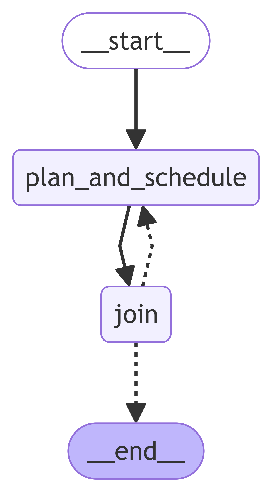
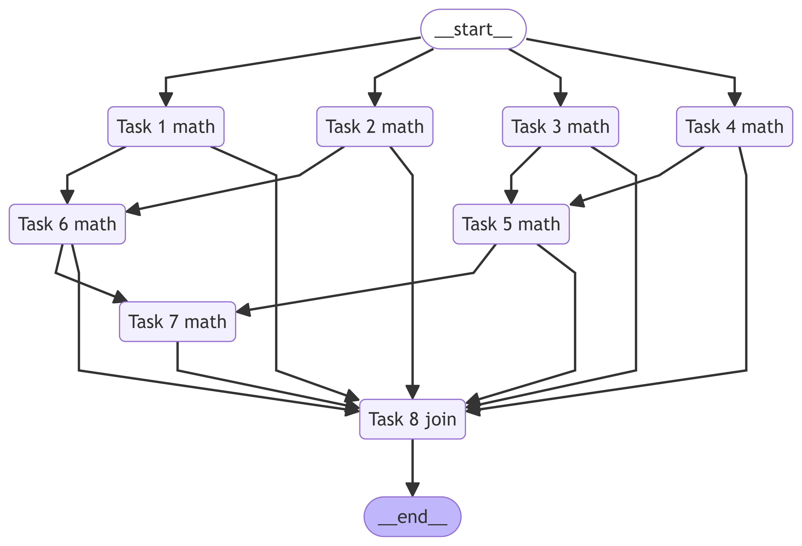

# PRINT DAG DEMO

&emsp;This is a complete case for performing mathematical operations, where the dependency relationships between `tool`s
can be fully visualized by setting the `print_dag` parameter.

## Code
```python
from llmcompiler.tools.basic import Tools
from llmcompiler.result.chat import ChatRequest
from langchain_openai.chat_models.base import ChatOpenAI
from llmcompiler.chat.run import RunLLMCompiler

chat = ChatRequest(
    message="1. What is the result of ((3*(4+5)/0.5)+3245) plus 8, and what is the result when divided by 100? Calculate the results of the two values separately, then find their average."
            "2. What is 32 divided by 4.23, and what is their product? Calculate their average!"
            "3. What is the product of all the averages divided by two?")

tools = Tools.load_tools("../llmcompiler/tools/math")
print(tools)

llm = ChatOpenAI(model="gpt-4o", temperature=0, max_retries=3)

llm_compiler = RunLLMCompiler(chat, tools, llm, print_dag=True)
print(llm_compiler())
```

## LangGraph Visualization



## Tasks Visualization



## Result
```
[Math()]
==========================初始化工具集和Agent：0.0秒==========================
We can convert a graph class into Mermaid syntax.
On https://www.min2k.com/tools/mermaid/, you can view visual results of Mermaid syntax.
%%{init: {'flowchart': {'curve': 'linear'}}}%%
graph TD;
	__start__([__start__]):::first
	plan_and_schedule(plan_and_schedule)
	join(join)
	__end__([__end__]):::last
	__start__ --> plan_and_schedule;
	plan_and_schedule --> join;
	join -.-> plan_and_schedule;
	join -.-> __end__;
	classDef default fill:#f2f0ff,line-height:1.2
	classDef first fill-opacity:0
	classDef last fill:#bfb6fc

================================ Rewriter Without LLM ================================
请基于用户问题，并结合相关信息和参考计划，生成一个专业且简洁的最少执行计划。
相关信息中可能会包含一些相关的数据信息可以作为`常量`使用，生成`Plan`时请认真检查。
但是切记不要构造用户问题和相关信息中没有提供的`常量`信息，例如基金代码没有提供则必须使用Tool查询，这很重要。

**用户问题**
1.  ((3*(4+5)/0.5)+3245)加8等于多少，除以100是多少？分别计算两个值的结果然后求平均值是多少？2. 32除以4.23是多少，乘积是多少？计算他们的平均值！3. 所有平均值的乘积除以二是多少？

**相关信息**


**参考计划**


Let’s think step by step!

================================ Planer Compiler ================================
math
---
idx: 1
tool: math
args: {'problem': '3*(4+5)/0.5 + 3245 + 8'}
dependencies: []
thought: None
---

math
---
idx: 2
tool: math
args: {'problem': '((3*(4+5)/0.5 + 3245) + 8) / 100'}
dependencies: []
thought: None
---

math
---
idx: 3
tool: math
args: {'problem': '32 / 4.23'}
dependencies: []
thought: None
---

math
---
idx: 4
tool: math
args: {'problem': '32 * 4.23'}
dependencies: []
thought: None
---

math
---
idx: 5
tool: math
args: {'problem': '($3 + $4) / 2', 'context': ['$3', '$4']}
args<Analyzed>: {'problem': '($3 + $4) / 2', 'context': [[7.565011820330969], [135.36]]}
dependencies: [3, 4]
thought: None
---

math
---
idx: 6
tool: math
args: {'problem': '($1 + $2) / 2', 'context': ['$1', '$2']}
args<Analyzed>: {'problem': '($1 + $2) / 2', 'context': [[3307], [33.07]]}
dependencies: [1, 2]
thought: None
---
math
---
idx: 7
tool: math
args: {'problem': '$5 * $6 / 2', 'context': ['$5', '$6']}
args<Analyzed>: {'problem': '$5 * $6 / 2', 'context': [[71.46250591016549], [1670.035]]}
dependencies: [5, 6]
thought: None
---

---
idx: 8
tool: join
args: ()
dependencies: [1, 2, 3, 4, 5, 6, 7]
thought: None
---
We can convert a graph class into Mermaid syntax.
On https://www.min2k.com/tools/mermaid/, you can view visual results of Mermaid syntax.
%%{init: {'flowchart': {'curve': 'linear'}}}%%
graph TD;
	__start__([__start__]):::first
	__end__([__end__]):::last
	1(Task 1 math)
	2(Task 2 math)
	3(Task 3 math)
	4(Task 4 math)
	5(Task 5 math)
	6(Task 6 math)
	7(Task 7 math)
	8(Task 8 join)
	3 --> 5;
	4 --> 5;
	1 --> 6;
	2 --> 6;
	5 --> 7;
	6 --> 7;
	1 --> 8;
	2 --> 8;
	3 --> 8;
	4 --> 8;
	5 --> 8;
	6 --> 8;
	7 --> 8;
	__start__ --> 1;
	__start__ --> 2;
	__start__ --> 3;
	__start__ --> 4;
	8 --> __end__;
	classDef default fill:#f2f0ff,line-height:1.2
	classDef first fill-opacity:0
	classDef last fill:#bfb6fc

==========================Iteration 1, ['plan_and_schedule']: 22.83秒==========================
================================ Joiner ================================
{
    "_thought_": "我已经计算了所有需要的值，并且得到了最终的结果。",
    "_finish_": "1. ((3*(4+5)/0.5)+3245)加8等于3307，除以100等于33.07。它们的平均值是1670.035。2. 32除以4.23等于7.565，乘积是135.36。它们的平均值是71.4625。3. 所有平均值的乘积除以二是59672.443。"
}
==========================Iteration 1, ['join']: 5.0秒==========================
response='1. ((3*(4+5)/0.5)+3245)加8等于3307，除以100等于33.07。它们的平均值是1670.035。2. 32除以4.23等于7.565，乘积是135.36。它们的平均值是71.4625。3. 所有平均值的乘积除以二是59672.443。' charts=[] source=[] labels=[]

Process finished with exit code 0
```
